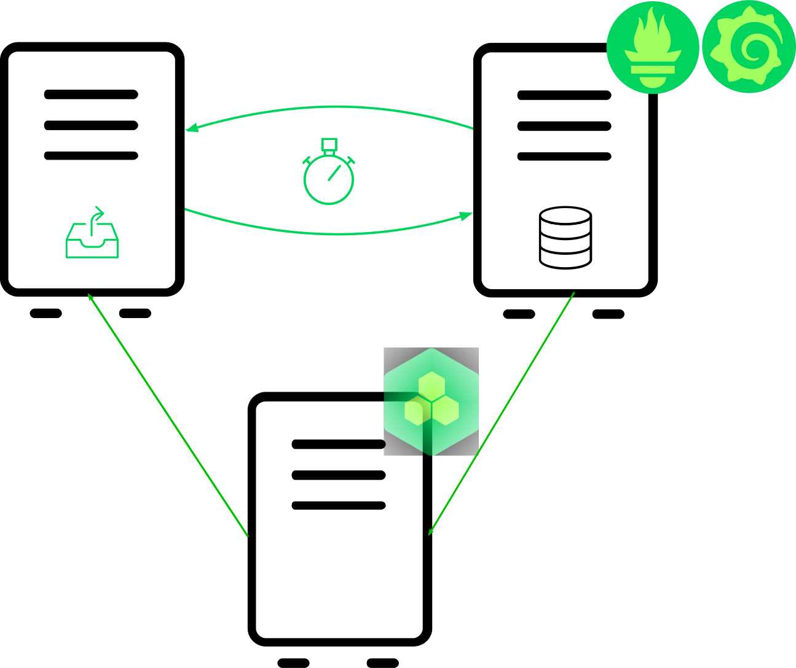

<!-- .slide: data-state="divider" id="new_features" data-timing="20s" data-menu-title="Automated Configuration" -->
# Automated Configuration


<!-- .slide: data-state="normal" id="new_architecture" data-timing="20s" data-menu-title="SUMA monitoring" -->
## Monitoring with SUSE Manager

<div class="breadcrumbs">Automated Configuration</div>

* Prometheus Salt formula
* Grafana Salt formula
* Prometheus Uyuni Service Discovery

<!-- .element class="col1" -->



<!-- .element class="col1" -->


<!-- .slide: data-state="normal" class="full-screen" id="prom_formula" data-timing="20s" data-menu-title="Prometheus formula" -->


<!-- .slide: data-state="normal" id="prom_config" data-menu-title="Prometheus configuration" -->
## Prometheus configuration

<div class="breadcrumbs">Automated Configuration</div>

`http://<prometheus_host>:9090/config`

```yaml
scrape_configs:
- job_name: mgr-server
  honor_timestamps: true
  scrape_interval: 15s
  scrape_timeout: 10s
  metrics_path: /metrics
  scheme: http
  static_configs:
  - targets:
    - server.tf.local:9100
    - server.tf.local:5556
    - server.tf.local:5557
    - server.tf.local:9800
  - targets:
    - server.tf.local:80
    labels:
      __metrics_path__: /rhn/metrics
  - targets:
    - server.tf.local:9187
    labels:
      role: postgres
```


<!-- .slide: data-state="normal" id="SD" data-timing="20s" data-menu-title="Prometheus Service Discovery" -->
## Prometheus Service Discovery

<div class="breadcrumbs">Automated Configuration</div>

* **Service Discovery** (SD) is Prometheus mechanism to automate targets configuration
* **Uyuni API** used as registry of monitored systems and groups
* transparent for users

<!-- .element class="col1" -->


<!-- .element class="col2" -->


<!-- .slide: data-state="normal" id="sd_config" data-menu-title="Prometheus SD configuration" -->
## Uyuni Service Discovery configuration

<div class="breadcrumbs">Automated Configuration</div>

`http://<prometheus_host>:9090/config`

```yaml
- job_name: mgr-clients
  honor_timestamps: true
  scrape_interval: 15s
  scrape_timeout: 10s
  metrics_path: /metrics
  scheme: http
  uyuni_sd_configs:
  - host: https://server.tf.local
    username: admin
    password: admin
    refresh_interval: 1m
```


<!-- .slide: data-state="normal" class="full-screen" id="grafana_formula" data-timing="20s" data-menu-title="Grafana formula" -->


<!-- .slide: data-state="blank-slide" class="full-screen" id="grafana_dashboard" data-menu-title="Grafana dashboard example" data-timing="10s" -->
<a title="Grafana dashboard example">
    
</a>
