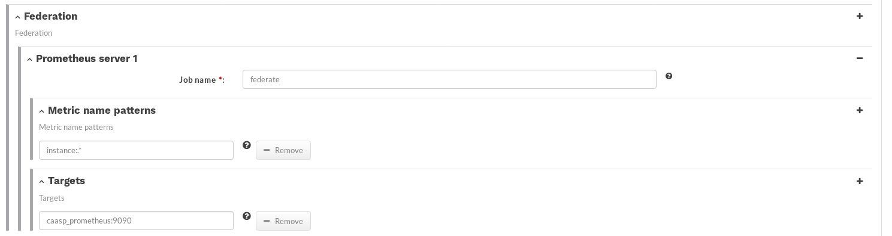

<!-- .slide: data-state="divider" id="federation" data-timing="20s" data-menu-title="Prometheus Federation" -->
# Prometheus Federation


<!-- .slide: data-state="normal" id="hierarchy" data-timing="20s" data-menu-title="Prometheus Hierarchical Federation" -->
## Prometheus Hierarchical Federation

<div class="breadcrumbs">Federation</div>

* each **cluster** or **application domain** has own monitoring server
* **recording rules** are calculated on each server
* **meta-Prometheus** collects aggregated measurements

<!-- .element class="col1" -->


<!-- .element class="col2" -->


<!-- .slide: data-state="normal" id="federation_formula" data-timing="20s" data-menu-title="Federation formula" -->
## Federation setup

<div class="breadcrumbs">Federation</div>




<!-- .slide: data-state="normal" id="federation_config" data-menu-title="Federation configuration" -->
## Federation Configuration

<div class="breadcrumbs">Federation</div>

`http://<prometheus_host>:9090/config`

```yaml
- job_name: federate
  honor_labels: true
  honor_timestamps: true
  params:
    match[]:
    - '{job="prometheus"}'
    - '{__name__=~"instance:.*"}'
  scrape_interval: 15s
  scrape_timeout: 10s
  metrics_path: /federate
  scheme: http
  static_configs:
  - targets:
    - caasp_prometheus:9090
```

<!-- .element class="col1" -->

**Notice**: `basic_auth` has to be manually configured for now.

<!-- .element class="col2-small" -->


<!-- .slide: data-state="normal" class="full-screen" id="caasp_grafana" data-timing="20s" data-menu-title="CaaSP dashboards" -->


<!-- .slide: data-state="blank-slide" class="full-screen" id="caasp_cluster" data-menu-title="Grafana dashboard example" data-timing="10s" -->
<a title="CaaSP Cluster Dashboard">
    
</a>
